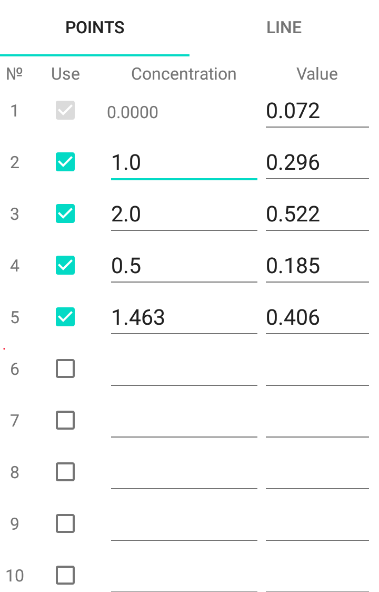
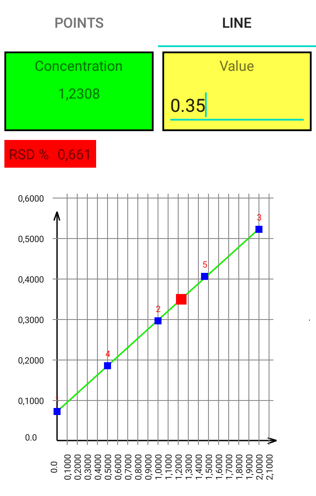

# calibration-line
Android light program for make up calibration graph for any analytical device

App supports saving/reading before saved data to/from .csv format. It can make linear greaphs only as yet. 
After building calibration, app can calculate unknown concentration from measured device signal (indicated as red point). 

